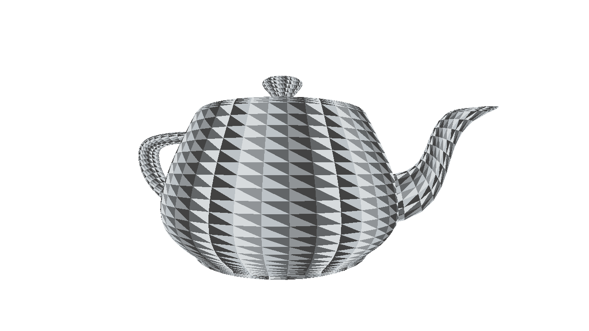
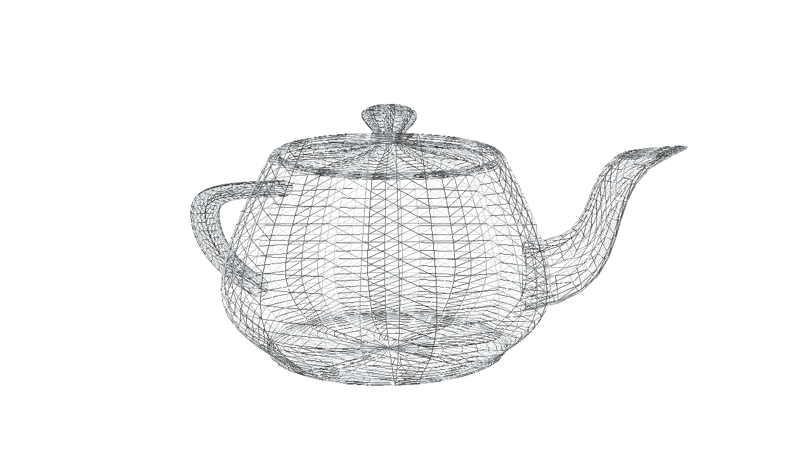
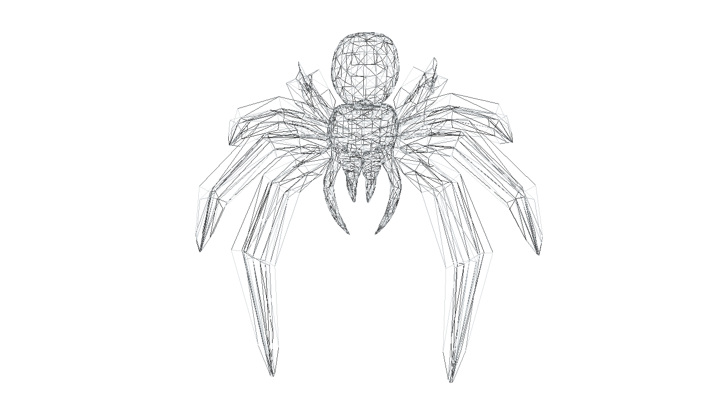

# Scop

Scop est un projet graphique ayant pour but de représenter des objets 3D grâce à OpenGL.

Comme pour la plupart des projets de notre école, quelques contraintes étaient imposées :

- Utiliser exclusivement le langage **C**
- Utiliser uniquement une bibliothèque pour la gestion des fenêtres et la création d'un contexte OpenGl.

Au vu des contraintes j'ai décidé de créer ma propre bibliothèque pour gérer les matrices. J'ai choisi de représenter celles-ci sous forme de structures et non de tableaux. En effet, choisir une structure comme représentation me permet de pouvoir d'avoir une matrice comme valeur de retour depuis une fonction. Si j'avais fait le choix d'utiliser des tableaux, ce cas aurait été un peu plus complexe. J'aurais dû créer le tableau en utilisant la fonction malloc ou préalablement sur la pile en le passant ensuite en paramètre de ma fonction. Comme en mémoire ces deux réprésentations sont les même, il m'a paru plus intéressant d'utiliser des structures.
Cela permet une meilleure lisibité du code, notamment pour les fonctions de transformation.

## Lancer le progamme

### Dépendences

**GLFW**, la bibliothèque que j'utilise, est installé depuis ses sources à l'aide d'un script inclus dans le makefile. Celle-ci a elle même des dépendances que vous pouvez retrouver [ici](https://www.glfw.org/docs/3.3/compile.html).
Si vous utilisez une distribution basé sur debian, vous pouvez simplement lancer le script `dependencies.sh` avec la commande :

```bash
sudo bash dependencies.sh
```

### Exécution

Une fois les dépendences installées vous pouvez utiliser les commandes suivantes pour exécuter le programme :

```bash
make
./scop resources/teapot.obj
```

Les commandes de contrôle sont affichées sur la sortie standard.

## Captures d'écran

**Théière :**



**Araignée :**


